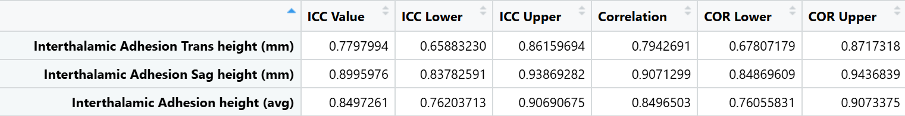
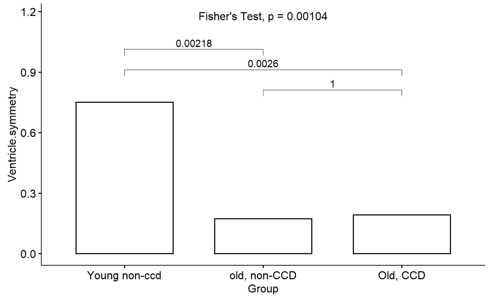

# Identifying Canine Cognitive Dysfunction
May 2024 - June 2024

## Overview
This undergraduate research project, conducted in collaboration with a graduate student, analyzed veterinary brain data from Colorado State University to identify regions of the brain associated with Canine Cognitive Dysfunction (CCD), a cognitive disease common in older dogs.

The goal of the project was to explore patterns in brain metrics that may indicate early signs of CCD and provide insights for further veterinary research.

## Objective
- Identify which brain regions are most strongly associated with CCD in aging dogs.
- Perform statistical analysis and visualization to summarize findings.
- Provide this introductory analysis to the CSU veterinarian team to further their research.

## Data
The dataset used for this project was provided by Colorado State University and was apart of an undergraduate research study. Therefore, the raw data is private and cannot be shared publicly.

Generally, the data documented 31 different brain measurements for a dog as well as their name, age, CCD diagnosis, and what veterinarian collected the data. Note that two veterinarians collected measurements for each dog (so each dog had two observations within the dataset).

A categorical variable that denotes the diagnosis was used for analysis. Dogs were classified based on their age and if they showed symptoms of CCD. They belonged to the following groups:
- Young, non-CCD
- Old, non-CCD
- Old, CCD

## The Analysis
- **Data Cleaning**
  - Continuous and binary variables were separated into distinct datasets.
  - Removing NA values.
- **Intraclass Correlation Coefficient (ICC) & Correlation Values**
  - ICC was used to determine how closely each veterinarian rated the dog's measurements.
  - An ICC rating of 1 means the veterinarians measured similarly while a rating of 0 means their measurements heavily differed.
  - A simple Pearson correlation value was also calculated to determine if the veterinarians measurements were correlated.
  - A small example of the ICC/Correlation table (lower and upper bounds are included):

- **Continuous Variable Analysis**
  - Kruskal-Wallis tests were used to determine the p-value between each group for each brain measurement.
  - Conover tests were pairwise between each diagnosis group.
  - The following visualization shows a variable that does show a difference in CCD dogs.
  - Right ventricle height visualization example:

- **Binary Variable Analysis**
   - Similarly, Fisher tests were used for the overall p-value and the pairwise p-values.
   - The following visualization shows a variable that only changes due to age, not CCD.
   - Ventricle symmetry visualization example:

- **Conclusion**
  - ICC values and correlations show that the two veterinarians typically measured similarly.
  - Found that roughly half of the brain measurements show evidence of a difference between non-CCD dogs (both young and old) than compared to older dogs that do show signs of CCD.
  - Listed as a co-author for a publication that is currently under review.

